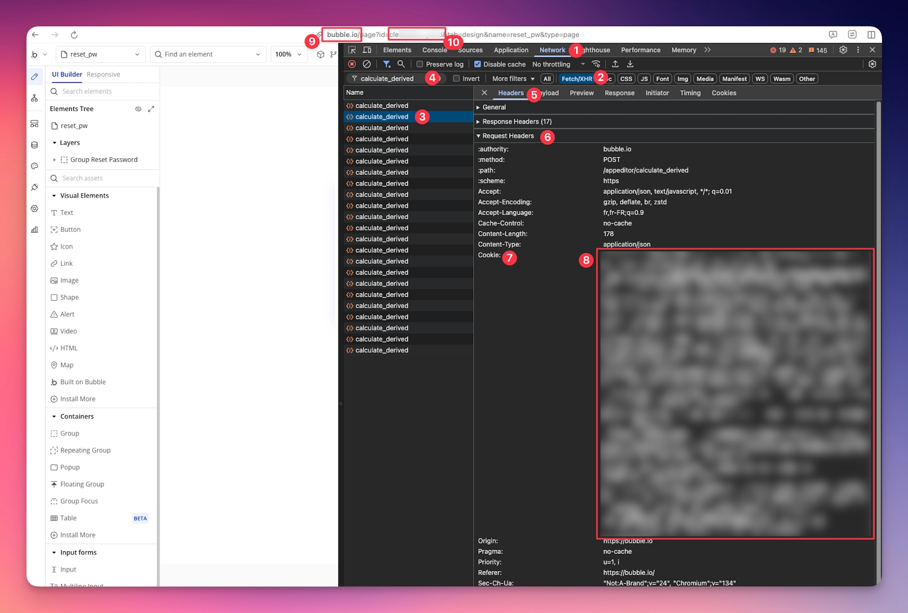
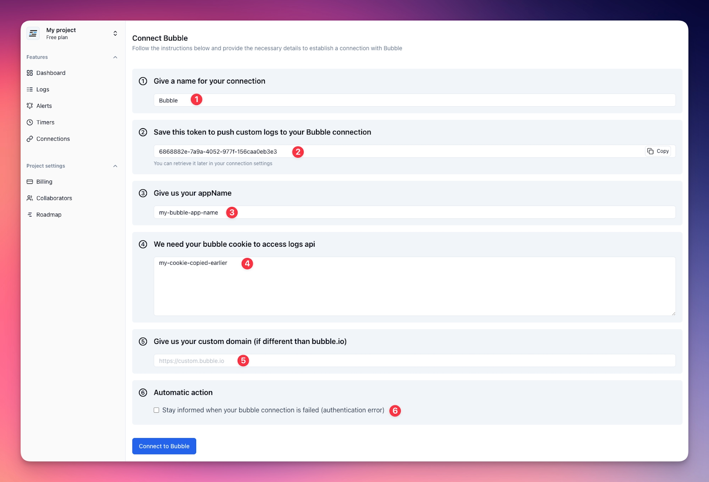

# Bubble integration

## Introduction

LogsForI provides a dedicated Bubble integration that automatically retrieves logs and timers from your Bubble application every 5 minutes. This seamless integration simplifies your monitoring process, enabling instant visibility into your application's activities without any manual setup.

By regularly capturing your app's logs and performance data, LogsForI helps you proactively detect issues, track events, and enhance the overall reliability and user experience of your Bubble-powered applications.

---

## Setup

### Get Bubble cookie

Before creating the connection, you need to retrieve your Bubble cookies.
Since Bubble does not provide an API to retrieve logs, we need to use the cookies to authenticate our requests.

To prevent disconnections, we recommend the following steps in private browsing session:

1. Connect to your Bubble account in your browser, and go to the editor page of your application you want to connect.
2. Open the **Developer Tools** by pressing `F12` or `Ctrl+Shift+I` (Windows/Linux) or `Cmd+Option+I` (Mac), or right-click on the page and select **"Inspect"**.
3. Go to the **"Network"** `(1)` tab and click on **"Fetch/XHR"** `(2)`.
4. On the name column, search for `calculate_derived` `(3)` (You can also use the filter bar `(4)` to search for `calculate_derived`).
5. Click on the `calculate_derived` line `(3)` to open the request details.
6. Go to the **"Headers"** tab `(5)` and find the **"Request Headers"** section `(6)`.
7. Copy the value `(8)` of the **"Cookie"** header `(7)` and save it for later use.

While we're here:
- Save you're Bubble custom domain `(9)` for later use if different than `bubble.io`.
- Save your Bubble app name `(10)` for later use (`id` parameter in the URL).

Now that we have the cookie, the custom domain and the app name, we can create the connection.

### Create a connection

On your LogsForI project, click on the **"Connections"** tab in the sidebar, then click on the **"New connection"** button at the top right corner. Here you'll see all available integrations. Click on **"Connect"** on the Bubble integration card.

The Bubble connection page will open, asking you to provide a **name** for your connection `(1)`, your **Bubble app name** `(3)` getting earlier, the **Bubble cookie** `(4)` getting earlier, and your **Bubble custom domain** `(5)` getting earlier (leave empty if `bubble.io`).

At the second step, LogsForI provides you a **token** `(2)` that allow you to send custom logs and timer to your LogsForI Bubble connection via our **API**. You can save it now for later use or retrieve it later by editing your connection when you need it.

Since we use a cookie connection for Bubble, we highly recommend to enable the `Stay informed when your bubble connection is failed (authentication error)` automatic action `(6)` to be informed when your connection is failed.

Once you've filled in the information, you can click the "Connect to Bubble" button at the bottom of the page.
You'll be redirected to the connections listing page, where you'll see your new Bubble connection.

### It's ready !
Your Bubble app is now fully configured with LogsForI! You can begin analyzing logs and setting up alerts to stay informed in real-time about errors or abnormal behaviors on your Bubble app.