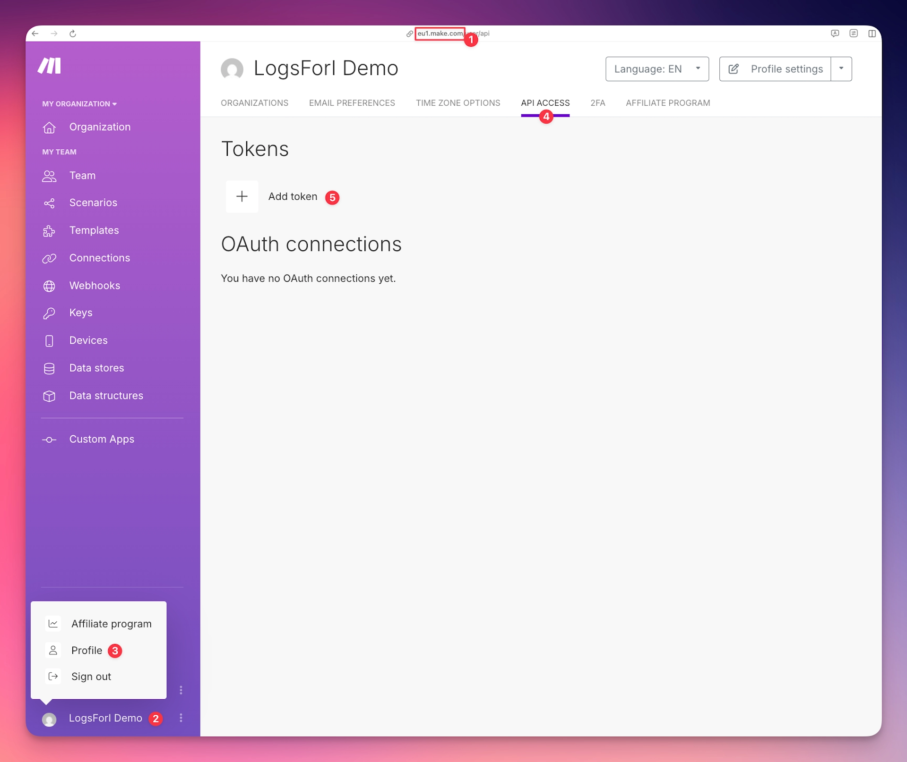
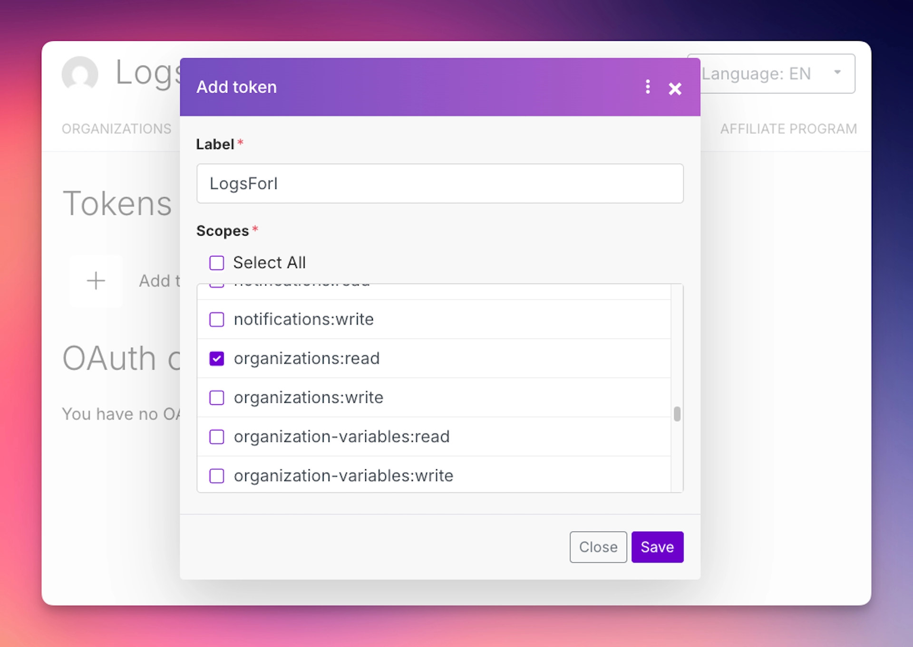
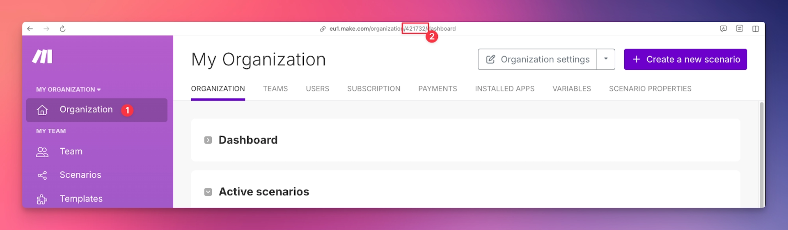
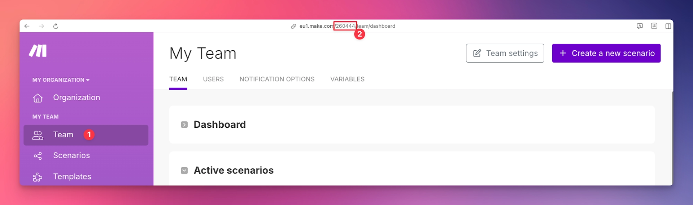
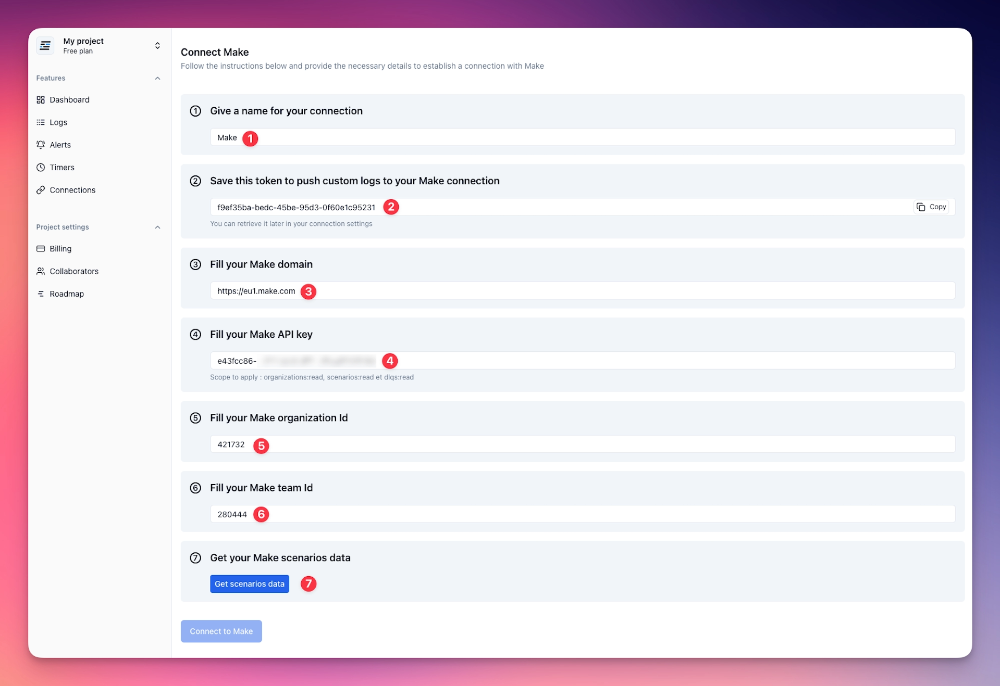
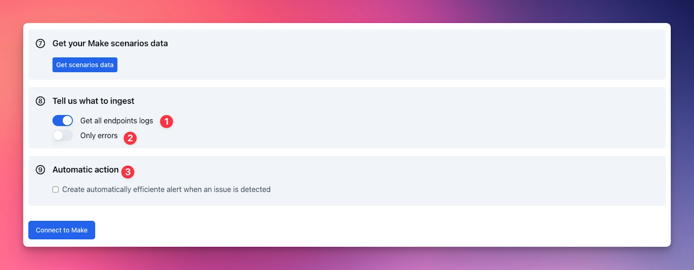

# Make integration

## Introduction

LogsForI provides a dedicated Make integration that automatically retrieves logs and timers from your Make scenarios every 5 minutes. This integration streamlines your monitoring efforts, giving you clear, consistent insights into your automations without any manual configuration.

With automated log collection, LogsForI enables you to proactively detect issues, analyze performance, and ensure optimal reliability for all your Make workflows.

---

## Setup

### Create Make API Key

Before creating the connection, you need to generate an API Key in Make, get your Make domain, get your Organization Id and Team Id.

1. Go to [Make.com](https://make.com/login) and go to the team you want to connect.
2. Save the domain of your team (https://`your-domain`.make.com) `(1)` for later use (should be something like `eu1.make.com`, `eu2.make.com`, `us1.make.com`, `us2.make.com`, ...).
3. Click on your profile picture `(2)` in the bottom right corner and click on **Profile** `(3)`.
4. On your profile page, go to **API Access** tab `(4)`.
5. Click on **Add Token** `(5)`.
6. Name your token and select the following scopes:
    - `scenarios:read`
    - `organizations:read`
    - `dlqs:read`
7. Click **Save** and copy the generated token for later use.

\

---

We also need your Organization Id and Team Id.

To get your Organization Id, click on `Organization` `(1)` in the sidebar and your id is in the url `(2)`, save it for later us.

To get your Team Id, click on `Team` `(1)` in the sidebar and your id is in the url `(2)`, save it for later us.

We now have your make domain, your API Key (token), your organization and team id needed to create the connection.

### Create a connection

On your LogsForI project, click on the **"Connections"** tab in the sidebar, then click on the **"New connection"** button at the top right corner. Here you'll see all available integrations. Click on **"Connect"** on the Make integration card.

The Make connection page will open, asking you to provide a **name** for your connection `(1)`, your **Make domain** `(3)`, the **Make API Key** `(4)` you generated earlier, your **Organization Id** `(5)` and your **Team Id** `(6)`.

At the second step, LogsForI provides you a token `(2)` that allow you to send custom logs and timer to your LogsForI Make connection via our **API**. You can save it now for later use or retrieve it later by editing your connection when you need it.

Once you've filled in the information, click the **"Get scenarios data"** button at the step 7 `(7)`. Our system will retrieve your Make scenarios data to allow you to setup your Make connection.

---

After the scenarios data are retrieved by our system, you have some extra options to configure your connection :

-   `(1)`**Get all endpoints logs**: By disabling this option, an new step will appear to allow you to select the scenarios you want to send logs to LogsForI.
-   `(2)`**Only errors**: Enable or disable only errors from your Make scenarios, for asking LogsForI to get only errors logs.
-   `(3)`**Automatic action**: Some actions automatically apply when you connect your Make to LogsForI, like creating a new alert for your Make connection when an error logs is detected. You can disable or enable them here.

When you're done, click the « Connect to Make » button at the bottom of the page. You'll be redirected to the connections listing page, where you'll see your new Make connection.

## It's ready !

Your Make is now fully configured with LogsForI! You can begin analyzing logs and setting up alerts to stay informed in real-time about errors or abnormal behaviors on your Make.
