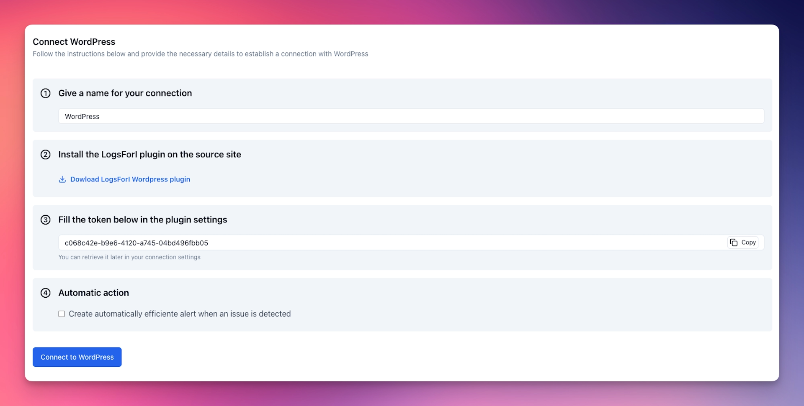
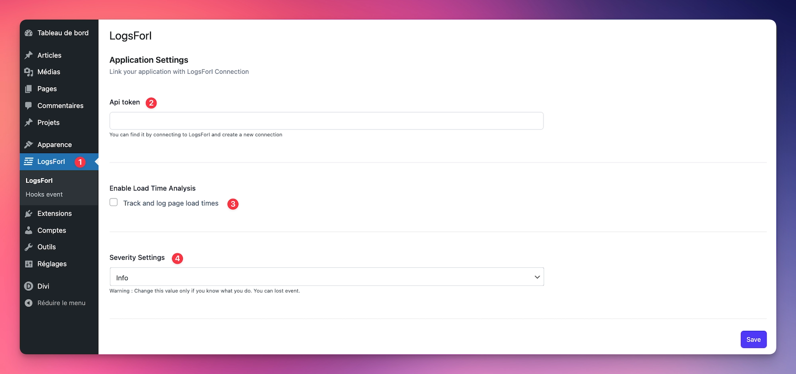
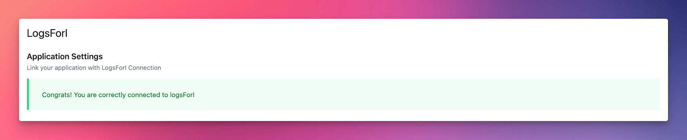
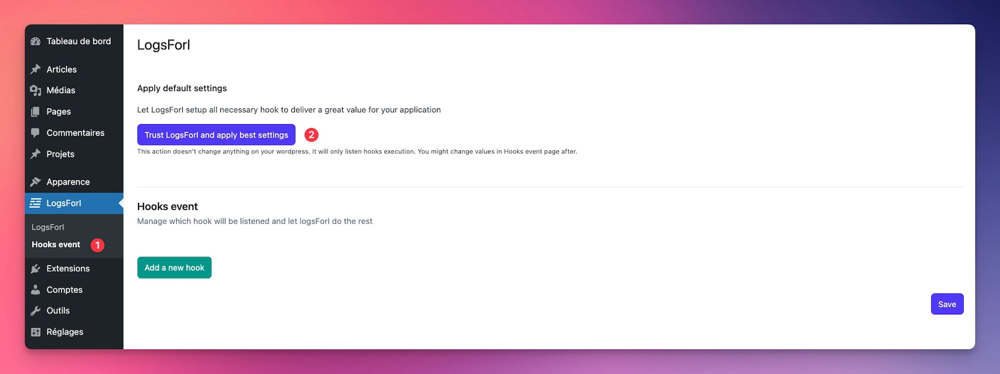

# WordPress integration

## Introduction

LogsForI provides a dedicated WordPress plugin that seamlessly integrates your WordPress site with the LogsForI dashboard, enabling easy and automatic monitoring of your site's activity.

With this integration, LogsForI automatically captures and sends logs whenever key WordPress hooks are triggered—such as when posts are published, updated, or deleted. Additionally, it offers full built-in support for WooCommerce events out-of-the-box.

Since every site is unique, LogsForI also allows you to effortlessly monitor custom hooks beyond the default ones provided by WordPress, giving you greater control over what you track.

Furthermore, you can enable the Analysis feature within the plugin settings. This will send detailed Timers to LogsForI, providing insights into page loading times, helping you optimize your site's performance and user experience.

---

## Setup

### Create a connection

On your LogsForI project, click on the "Connections" tab in the side bar and then click on the "New connection" button in the top right corner. Here you can see all the available integrations. Click on "Connect" on the WordPress integration card.

The WordPress connection page will open, asking you to provide some information, like the name you want to give your connection, and so on.

Follow the provided instructions, download the plugin using the link given in step 2, and copy the token provided in step 3, as you'll need it later.

Once you've filled in the information, downloaded the plugin, and copied your token, you can click the "Connect to WordPress" button at the bottom of the page.

You'll be redirected to the connections listing page, where you'll see your new WordPress connection.

### Install and configure the plugin

Next, log in to your WordPress admin dashboard and [install the plugin](https://wordpress.org/documentation/article/manage-plugins/#upload-via-wordpress-admin) just like any other WordPress plugin, then activate it.

Once installed and activated, navigate to the **"LogsForI"** tab on the left side of your WordPress admin dashboard `(1)`, andyou should see the following page:

Enter the token `(2)` provided during connection creation (you can find it again by editing the connection using the pencil icon on your connections list). Enable or disable the site loading time analysis `(3)` as desired, and select the minimum log level you'd like to send to LogsForI `(4)` (by default, `info` is recommended to avoid missing important logs).

Save your settings by clicking the **"Save"** button at the bottom right.\
If your token is correct, you'll see a success message at the top of the page, and your site will now be connected to LogsForI!

As it stands, the plugin only sends logs when a fatal error occurs. For improved observability of your site, it's recommended to enable additional logging settings. Go to the **"Hooks event"** submenu `(1)` and apply the recommended configuration by clicking **"Trust LogsForI and apply best settings"** `(2)`.

A predefined list of hooks and their severity levels will automatically apply to your site. You can modify the severity for each hook, and add or remove hooks as needed under the **Hooks event** section of this page.

Remember to save your changes by clicking **"Save"** at the bottom right.

## It's ready !
Your site is now fully configured with LogsForI! You can begin analyzing logs and setting up alerts to stay informed in real-time about errors or abnormal behaviors on your site.