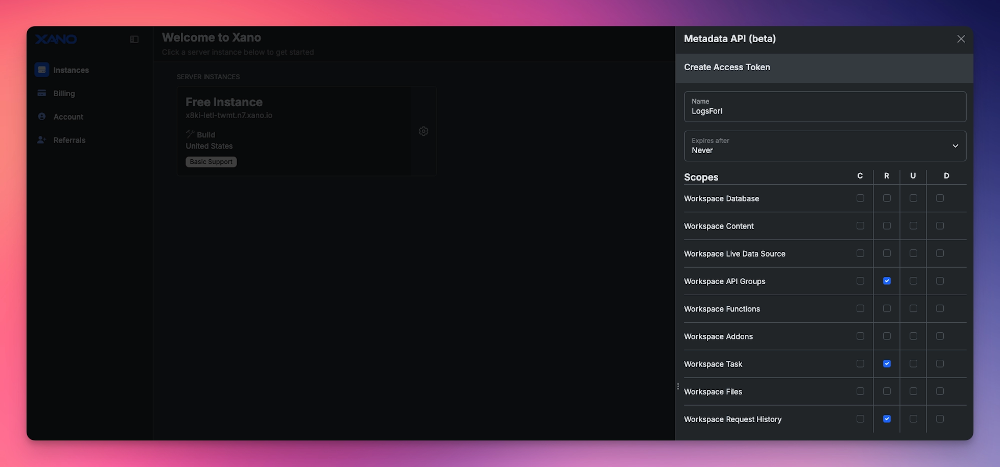
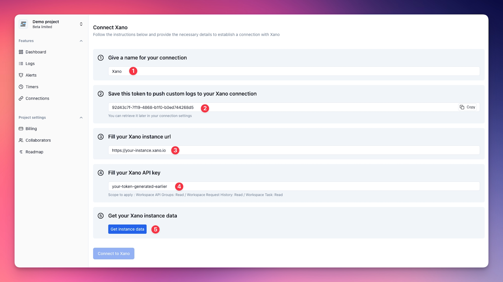
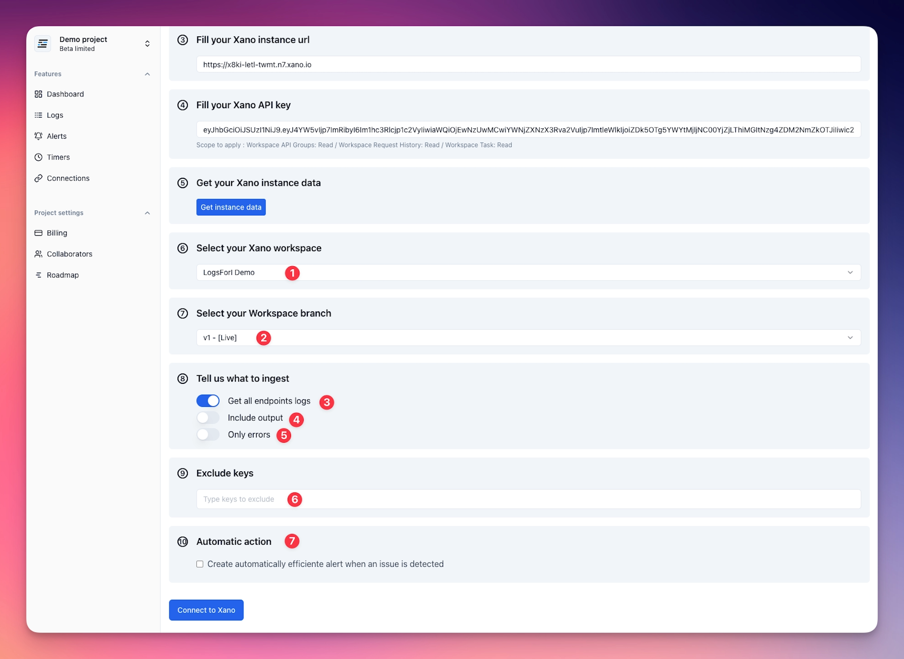

# Xano integration

## Introduction

LogsForI provides a dedicated Xano integration that automatically retrieves logs and timers from your Xano application every 5 minutes. This integration simplifies your monitoring setup, enabling effortless visibility into your backend processes without requiring manual configuration.

With automated data retrieval, LogsForI helps you quickly identify performance issues, errors, or unusual behaviors, ensuring your Xano-powered application remains stable and responsive.

---

## Setup

### Create Xano Token

Before creating the connection, you need to generate a token in Xano.

1. Go to [Xano instance listing](https://app.xano.com/instance).
2. Click on the **gear icon** on the instance card you want to connect.
3. On the sidebar that appears, click on the **"Metadata API" > "Manage Access Tokens"**.
4. Create a new token by clicking on the **"+ New Access Token"** button.
5. Name your access token and set "expires after" to **Never**.
6. LogsForI request the following scopes:
    - `Workspace API Groups:read`
    - `Workspace Task:read`
    - `Workspace Request History:read`
7. Click on the **"Create"** button to generate the token.
8. Copy the token and save it for later use.

Xano Access Token setup:

We now have the token needed to create the connection.

### Create a connection

On your LogsForI project, click on the **"Connections"** tab in the sidebar, then click on the **"New connection"** button at the top right corner. Here you'll see all available integrations. Click on **"Connect"** on the Xano integration card.

The Xano connection page will open, asking you to provide a **name** for your connection `(1)`, your **Xano instance URL** (https://`your-instance`.xano.io) `(3)`, and the **Xano token** you generated earlier `(4)`.

At the second step, LogsForI provides you a **token** `(2)` that allow you to send custom logs and timer to your LogsForI Xano connection via our **API**. You can save it now for later use or retrieve it later by editing your connection when you need it.

Once you've filled in the information, click the **"Get instance data"** button at the step 5. Our system will retrieve your Xano instance data to allow you to select your **Xano workspace** `(1)` and **Xano branch** `(2)` you want to connect to LogsForI.

After selecting your **Xano workspace** and **Xano branch**, you have some extra options to configure your connection:
- `(3)`**Get all endpoints logs**: By disabling this option, an new step will appear to allow you to select the endpoints you want to send logs to LogsForI.
- `(4)`**Inlcude output**: Enable or disable the output of your Xano endpoints.
- `(5)`**Only errors**: Enable or disable only errors from your Xano instance, for asking LogsForI to get only errors logs.
- `(6)`**Eclude keys**: Add keys you want to exclude from your logs, usefull for hiding sensitive data.
- `(7)`**Automatic action**: Some actions automatically apply when you connect your Xano instance to LogsForI, like creating a new alert for your Xano connection when an error logs is detected. You can disable or enable them here.

When you're done, click the **"Connect to Xano"** button at the bottom of the page.
You'll be redirected to the connections listing page, where you'll see your new Xano connection.

## It's ready !
Your Xano instance is now fully configured with LogsForI! You can begin analyzing logs and setting up alerts to stay informed in real-time about errors or abnormal behaviors on your Xano instance.